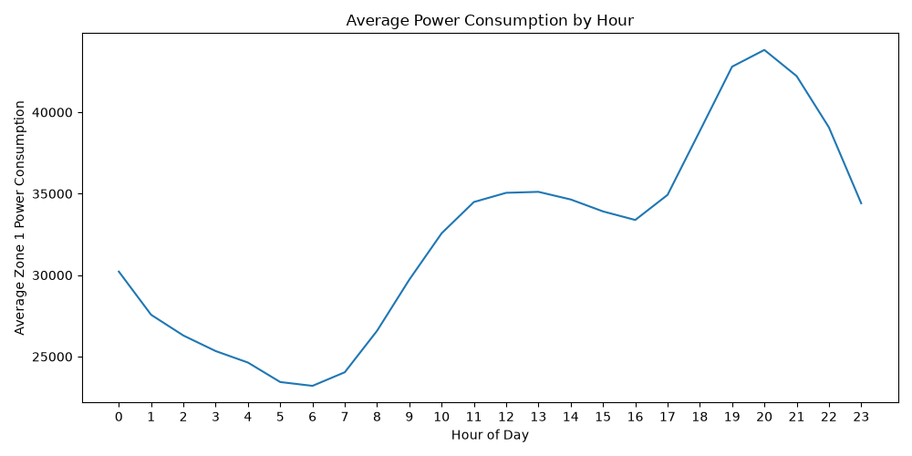

# Tetouan City Power Consumption

This project uses the Tetouan City Power Consumption dataset to investigate whether electricity consumption can be predicted from time, weather and light measurements.

The project combines:

* PostgreSQL for data storage and preparation
* SQL for data and feature preparation
* Python and NumPy for model training
* Linear Regression implemented from scratch
* Minibatch Stochastic Gradient Descent from scratch for optimization
* Matplotlib for visualization

## Dataset

The dataset contains the electricity consumption and various additional measurements from Tetouan in Morocco.

The Measurements of this dataset were recorded at 10 minutes intervals during 2017.

The dataset contains:

* 52,416 observations (rows)
* 9 columns:
* 1 datetime column
* 5 environmental and light measurements
* 3 electricity consumption measurements

| Variable                   | Description                       |
| -------------------------- | --------------------------------- |
| `DateTime`                 | Date and time of the measurement  |
| `Temperature`              | Temperature                       |
| `Humidity`                 | Relative humidity                 |
| `Wind Speed`               | Wind speed                        |
| `general diffuse flows`    | General diffuse light flow        |
| `diffuse flows`            | Diffuse light flow                |
| `Zone 1 Power Consumption` | Electricity consumption in Zone 1 |
| `Zone 2 Power Consumption` | Electricity consumption in Zone 2 |
| `Zone 3 Power Consumption` | Electricity consumption in Zone 3 |

This project focuses on **Zone 1 Power consumption**

## Data Preperation

### PostgreSQL

The raw CSV datset is imported into PostgreSQL and stored in the power_consumption table.

SQL is used to:

* create the database table
* import the dataset
* verify the number of observations
* check the avaible time period
* check for missing values
* prepare the machine learning dataset

The prepared data is stored in power_consumption_ml.

Additional time based features hour, day of week and month are extracted from DateTime:

## Data Exploration

Before training the model the prepared dataset is explored to understand understand its structure and identify relationships between the variables.

### Data Quality

No missing values were found in the dataset and therefore all 52,416 observations are used in the analysis.

### Zone 1 Consumption
The target variable has the following values:

| Statistic | Consumption |
| --------- | ----------: |
| Mean      |   32,344.97 |
| Minimum   |   13,895.70 |
| Maximum   |   52,204.40 |


### Consumption Throughout the Day

Average electricity consumption changes considerably depending on the hour of the day.

The average consumption reaches its lowest level around the early morning and its highest level around the evening.



This strong daily pattern is also reflected in the model where hour receives the largest standardized coefficient.

### Correlation

The correlation between the features an Zone 1 power consumption was also examined.

| Feature               | Correlation |
| --------------------- | ----------: |
| Hour                  |       0.728 |
| Temperature           |       0.440 |
| General diffuse flows |       0.188 |
| Wind speed            |       0.167 |
| Diffuse flows         |       0.080 |
| Day of week           |       0.040 |
| Month                 |      -0.005 |
| Humidity              |      -0.287 |

The strongest linear relationship is between hour and power consumption.

## Machine Learning

### Model

The project uses the portfolios own Linear Regression class implemented from scratch using NumPy.

The model is:

$$\hat{y} = Xw + b$$

where:

* X represents the input features
* w represents the learned coefficients
* b represents the bias
* $\hat{y}$ represents the predicted power consumption

The optimization is performed using the portfolios own Minibatch SGD implementation.

### Features

The model uses eight input features:

```text
hour
day_of_week
month
temperature
humidity
wind_speed
general_diffuse_flows
diffuse_flows
```

The target is:

```text
target_power_consumption
```

### Train/Test Split

Because the observations are time ordered a chronological split is used for the train and testing instead of randomly shuffling the complete dataset.

Training:

**41,932 observations: 80%**

```text
2017-01-01 00:00:00
        ↓
2017-10-19 04:30:00
```

Testing:

**10,484 observations: 20%**

```text
2017-10-19 04:40:00
        ↓
2017-12-30 23:50:00
```

## Dataset Reference

* Salam, A., & El Hibaoui, A. (2018). *Comparison of Machine Learning Algorithms for the Power Consumption Prediction: Case Study of Tetouan city*. UCI Machine Learning Repository.
  https://archive.ics.uci.edu/dataset/849/power+consumption+of+tetouan+city